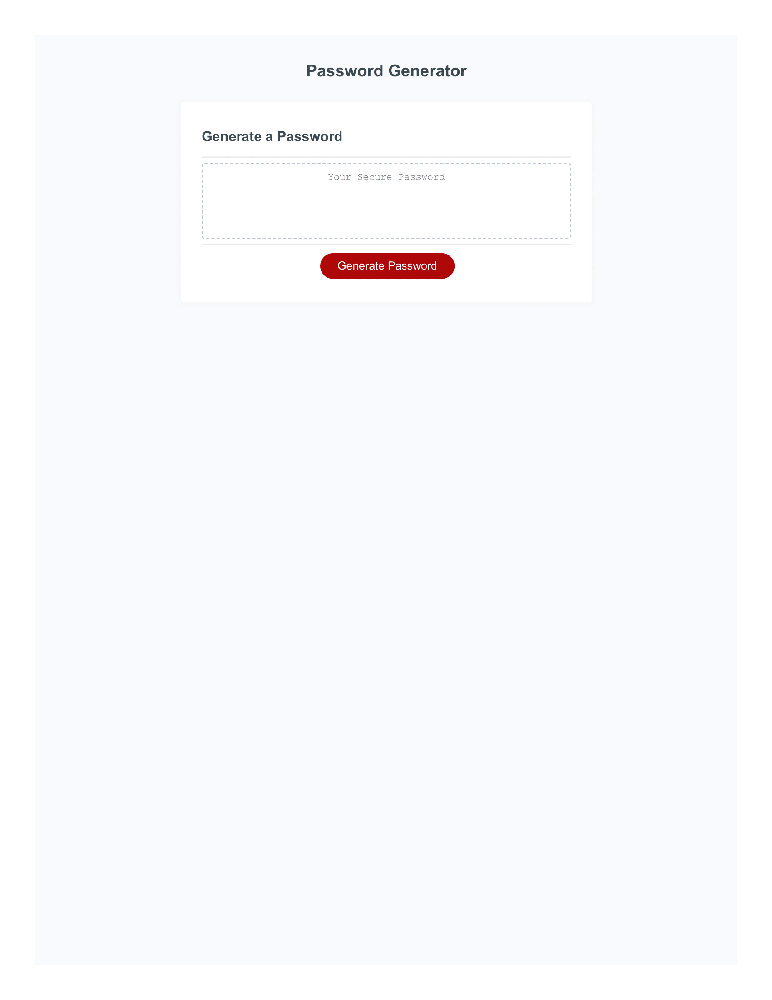

# 03 JavaScript: Password Generator

## Your Task

This week's Challenge requires you to modify starter code to create an application that enables employees to generate random passwords based on criteria that they’ve selected. This app will run in the browser and will feature dynamically updated HTML and CSS powered by JavaScript code that you write. It will have a clean and polished, responsive user interface that adapts to multiple screen sizes.

The password can include special characters. If you’re unfamiliar with these, see this [list of password special characters](https://www.owasp.org/index.php/Password_special_characters) from the OWASP Foundation.

## User Story

```
AS AN employee with access to sensitive data
I WANT to randomly generate a password that meets certain criteria
SO THAT I can create a strong password that provides greater security
```

## Acceptance Criteria

```
GIVEN I need a new, secure password
WHEN I click the button to generate a password
THEN I am presented with a series of prompts for password criteria
WHEN prompted for password criteria
THEN I select which criteria to include in the password
WHEN prompted for the length of the password
THEN I choose a length of at least 8 characters and no more than 128 characters
WHEN asked for character types to include in the password
THEN I confirm whether or not to include lowercase, uppercase, numeric, and/or special characters
WHEN I answer each prompt
THEN my input should be validated and at least one character type should be selected
WHEN all prompts are answered
THEN a password is generated that matches the selected criteria
WHEN the password is generated
THEN the password is either displayed in an alert or written to the page
```

## Mock-Up

The following image shows the web application's appearance and functionality:


## The Password Generator

The Password Generator application displays a red button to generate a password using javascript. The first prompt that will be asked once the button is clicked is the amount of characters you would like in your password (8 - 128 characters). You will also be prompted to choose different characters for the password field, such as, lowercase letters, uppercase letters, numbers, and special characters. When all the prompts are answered the application will generate a password. If the password length chosen is not within the parameters you will be given a prompt notifying you that you must choose a password between the parameters given. If you fail to accept at least one of the 4 parameter choices you will be returned to the beginning of the function to generate a password.


Deployed page
https://rudezy.github.io/Password-Generator/

